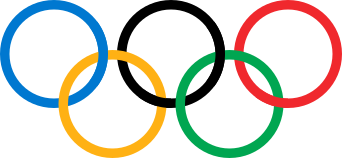

# Olympic Data Visualization Project



## Live Demo

**View the live application:** [https://olympix-five.vercel.app/](https://olympix-five.vercel.app/)

## Overview

This project provides interactive visualizations of Olympic Games data across time, countries, and sports. It allows users to explore medal counts, athlete demographics, gender participation trends, and performance metrics through intuitive and responsive data visualizations.

This website was developed as a course project for CS661: Big Data Visual Analytics under Prof. Soumya Dutta in the 2024-25 II semester at IIT Kanpur.

## Features

The application offers several interactive dashboards:

- **Medal Dashboard**: Interactive global medal counts and rankings with a world map visualization, historical trends, and country comparisons
- **Age vs Performance**: Analysis of how athlete age affects Olympic performance, including age distribution, peak performance age, and sport-specific age trends
- **Gender Participation**: Visualization of gender balance evolution in Olympics over time, with breakdowns by sport and season
- **Sports Analysis**: Detailed metrics for different Olympic sports, including participation trends and performance comparisons
- **Country Analysis**: Nation-specific Olympic performance data with medal counts and historical participation
- **Miscellaneous**: Additional interesting Olympic insights, including host country advantage analysis

## Technologies Used

- **Frontend**: Next.js 13+ (App Router), React
- **Data Visualization**: D3.js, Recharts, React Simple Maps
- **Styling**: Tailwind CSS
- **Data Processing**: Papa Parse (CSV parsing)

## Getting Started

### Prerequisites

- Node.js 16.8 or later
- npm or yarn package manager

### Installation

1. Clone the repository:

```bash
git clone [https://github.com/abhijeeta21/Olympix.git](https://github.com/abhijeeta21/Olympix.git)
cd my-web-app
```

2. Install dependencies:

```bash
npm install
# or
yarn install
```

3. Start the development server:

```bash
npm run dev
# or
yarn dev
```

4. Open [http://localhost:3000](http://localhost:3000) with your browser to see the result.

## Project Structure

```
my-web-app/
├── app/                  # Next.js app router
│   ├── age_performance/  # Age vs Performance visualization
│   ├── countries/        # Country analysis visualizations
│   ├── gender_participation/ # Gender participation visualizations
│   ├── medal_dashboard/  # Medal distribution visualizations
│   ├── miscellaneous/    # Additional visualizations
│   ├── sports/           # Sports analysis visualizations
│   ├── globals.css       # Global styles
│   ├── layout.js         # Root layout
│   └── page.js           # Homepage
├── components/           # Reusable components
├── public/               # Static files
│   ├── data/             # CSV and JSON data files
│   └── images/           # Images and icons
├── tailwind.config.js    # Tailwind CSS configuration
├── postcss.config.js     # PostCSS configuration
└── README.md             # Project documentation
```

## Data

The visualizations are powered by Olympic Games datasets that include:
- Athlete information (age, gender, country, etc.)
- Medal counts by country and year
- Event and sport categorization
- Historical Olympic Games information

Data files needed for this application:
- `athlete_events.csv` - Main dataset with athlete data
- `noc_regions.csv` - Mapping of NOC codes to country names
- `year_host_country.csv` - Information about Olympic host countries
- Country-specific JSON files for country analysis pages

### Data Sources

The primary dataset is derived from the Kaggle Olympic Games dataset, which includes historical data about Olympic athletes and results from Athens 1896 to Rio 2016.

## Required Data Files

Place these data files in the `/public/data/` directory:

1. `athlete_events.csv` - Contains athlete information and medal results
2. `noc_regions.csv` - Maps NOC codes to country names
3. `year_host_country.csv` - Information about Olympic host countries by year

For country-specific pages, JSON files should be placed in `/public/countries/` with the format `{noc}_data.json`

## Deployment

This application can be deployed on Vercel or any other platform that supports Next.js applications:

```bash
# Build the application
npm run build
# or
yarn build

# Start the production server
npm start
# or
yarn start
```

## Features in Detail

### Medal Dashboard
- Interactive world map with country medal highlights
- Time-based filtering for specific Olympic years
- Comparison of multiple countries' medal performances over time
- Detailed breakdown of gold, silver, and bronze medals

### Age vs Performance
- Age distribution of Olympic athletes
- Peak performance age analysis
- Age trends over Olympic history
- Sport-specific age comparisons

### Gender Participation
- Timeline showing gender participation trends
- Sport-specific gender balance analysis
- Filters for Olympic seasons (Summer/Winter)
- Country-specific gender participation trends

### Country Analysis
- Individual country performance pages
- Comparative analysis between countries
- Medal distribution by type
- Historical participation data
- Top sports by athlete count

### Sports Analysis
- Sport-specific performance metrics
- Year and season filtering capabilities
- Medal distribution by country for specific sports


## Contributors

- Abhijeet Agarwal
- [Add additional contributor names here]
- [Add additional contributor names here]
- [Add additional contributor names here]

## Acknowledgements

- Olympic data sourced from Kaggle datasets
- Visualization libraries: D3.js, Recharts, React Simple Maps
- Next.js and React for the application framework
- Tailwind CSS for styling
